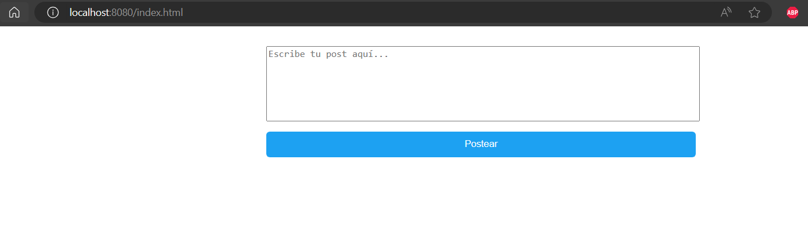

# TALLER DE MICROSERVICIOS

En este taller se implementó un sistema de publicación de posts de hasta 140 caracteres, similar al funcionamiento de Twitter. El sistema está construido utilizando Quarkus, un framework de Java diseñado para aplicaciones nativas en la nube. 
Se ha implementado como un monolito inicialmente, luego dividido en tres microservicios independientes utilizando AWS Lambda.

## Diseño de la aplicación 

La aplicación está diseñada para cumplir con los requisitos especificados en el enunciado del taller y proporcionar una experiencia de usuario fluida y satisfactoria.
El primer paso para el desarrollo de este laboratorio, fue la implementación de un monolito haciendo uso del
frameworj Quarkus.  A continuación, se describen los principales componentes y características de la aplicación:

- Se implementaron tres entidades fundamentales para el sistema: `Post`, `Stream` y `User`. 

- La clase `Post` representa cada publicación realizada en el sistema, con atributos que incluyen el propietario y el contenido del post. 

- La clase `Stream` encapsula una colección de posts, ofreciendo métodos para agregar y obtener posts. 

- La clase `User` proporciona la estructura necesaria para representar a los usuarios del sistema, incluyendo atributos como el nombre de usuario y la contraseña. Estos objetos User son fundamentales para identificar a los propietarios de los posts.

- La clase `PostController` es un controlador REST diseñado para manejar las solicitudes relacionadas con la entidad `Post`.
  Dentro de esta clase, se encuentra el método `savePost`,  el cual se encarga de recibir las solicitudes de los usuarios para publicar posts en el sistema y guardar la información en la capa de persistencia correspondiente. 

- La clase `StreamController` es un controlador REST diseñado para manejar las solicitudes relacionadas con la obtención de posts desde el sistema. Esta clase incluye el método `getPosts`, el cual se encarga de recuperar los posts almacenados en el sistema y devolverlos en formato JSON como respuesta a la solicitud.

- La clase `UserController` es un controlador REST diseñado para manejar las solicitudes relacionadas con la gestión de usuarios en el sistema

-  Para el monolito en Quarkus, se implementó la capa de persistencia en las clases Services de cada uno de los controladores. Para el despliegue en AWS, se hace uso de una base de datos Mongo.

## Guía de Inicio

Las siguientes instrucciones le permitirán descargar una copia y ejecutar la aplicación en su máquina local.

### Prerrequisitos

- Java versión 8 OpenJDK
- Maven
- Git

1. Ubíquese sobre el directorio donde desea realizar la descarga y ejecute el siguiente comando:

```shell script
  git clone https://github.com/Mateo0laya/AREP-Lab8-Microservices.git 
```
2. Navegue al directorio del proyecto:

```shell script
  cd AREP-Lab8-Microservices
```

3. Ejecute el siguiente comando para compilar el código:

```shell script
  mvn compile
```

4. Para iniciar el servidor, ejecute el siguiente comando:
```shell script
  mvn compile quarkus:dev
```

## Probando la Aplicación.

Ingrese a la siguiente URL para ingresar a el cliente: `http://localhost:8080/index.html`.



Ingrese la mensaje a postear:


De clic en el botón `Postear`,  podrá observar que los mensajes se muestran en la parte inferior.


# Despliegue en Amazon Web Services

A continuación, se describe la arquitectura de la aplicación en Amazon Web Services (AWS). La aplicación se despliega en la infraestructura de la nube de AWS para garantizar escalabilidad, disponibilidad y seguridad.

## Arquitectura


## Funciones Lambda

Se desplegaron dos microservicios utilizando funciones Lambda de AWS. Estos microservicios establecen conexión con una base de datos MongoDB para almacenar y gestionar los datos de la aplicación.
Para cada uno de los microservicios, se compiló el proyecto ubicado en la rama `cloud` del repositorio para generar un JAR con todas las dependencias necesarias para su despliegue en AWS Lambda.

`post-function`: Esta función Lambda implementa la lógica para almacenar los posts en la base de datos MongoDB. Cuando se invoca, recibe un nuevo post como entrada y lo guarda en la base de datos para su posterior recuperación y visualización. Es responsable de asegurar que los posts enviados por los usuarios se almacenen correctamente en la base de datos para su uso posterior. Se mapeó el método `savePost` de la clase `PostController` para este microservicio.


`stream-function`: Esta función Lambda se encarga de proporcionar información sobre los posts almacenados en la base de datos MongoDB. Se mapeó el método `getPosts` de la clase `StreamController` para este microservicio. Al ser invocado, este método recupera los posts de la base de datos y los devuelve como respuesta al cliente que realizó la solicitud.


El uso de funciones Lambda de AWS permite una arquitectura sin servidor, escalable y de alto rendimiento.

### Pruebas

`post-function`: Se envía un nuevo post en formato JSON. Este será tomado por la clase tras la consulta y registrado en la base de datos. Si la ejecución es correcta, devolverá una respuesta HTTP con código 201.


`stream-function`: No requiere input. Obtiene todos los registros de la base de datos.


## Amazon S3

Utilizamos Amazon S3 para almacenar nuestros archivos estáticos, como HTML, CSS, JavaScript e imágenes. Esto nos permite distribuir y servir estos archivos de manera eficiente a través de internet para nuestra aplicación web. Creamos un bucket `bucket-not-twitter` para nuestra aplicación:


Habilitamos el alojamiento de un sitio web estático:


## Amazon Cognito

En nuestra aplicación, utilizamos Amazon Cognito para gestionar la autenticación de usuarios antes de que accedan al sitio web estático alojado en Amazon S3. Cuando un usuario intenta acceder al sitio web, lo redirigimos a una página de inicio de sesión vinculada a Amazon Cognito. Allí, el usuario proporciona sus credenciales de inicio de sesión y Amazon Cognito valida estas credenciales. Si son válidas, el usuario recibe un token de acceso que lo identifica. Con este token, el usuario es redirigido de vuelta al sitio web estático, donde el token se utiliza para validar su acceso y permitirle interactuar con la aplicación web estática de acuerdo con sus permisos. Esto garantiza que solo los usuarios autenticados puedan acceder al contenido y las funcionalidades de nuestra aplicación web estática.
Creamos un grupo de usuarios `not-twitter-users-group`


## API Gateway 

En nuestra aplicación, hemos configurado el Gateway de API de AWS para actuar como el punto de entrada principal.


Esto nos permite gestionar las solicitudes HTTP entrantes de manera efectiva. Al definir recursos y métodos dentro de nuestra API, hemos establecido la estructura y el comportamiento de la interfaz que nuestra aplicación ofrece a los usuarios. Luego, hemos asignado nuestras funciones Lambda específicas para manejar estas solicitudes entrantes, asegurándonos de que cada solicitud se dirija al código adecuado para su procesamiento. 


Por ejemplo, cuando un usuario envía una solicitud POST al recurso "/posts", esta solicitud se enruta a nuestra función Lambda savePost, la cual se encarga de procesar y almacenar el nuevo post. Este enfoque nos ha permitido construir una interfaz de API robusta y escalable, proporcionando una experiencia fluida para nuestros usuarios mientras manejan las diversas funcionalidades de nuestra aplicación.

Seguridad de los endpoints:


## Video de despliegue


## Construido Con. 

- Maven - Administrador de dependencias

## Autores 

## Versión
1.0.0
